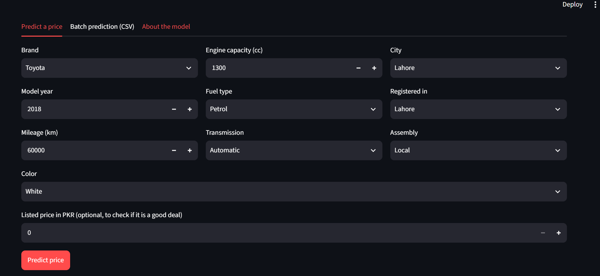
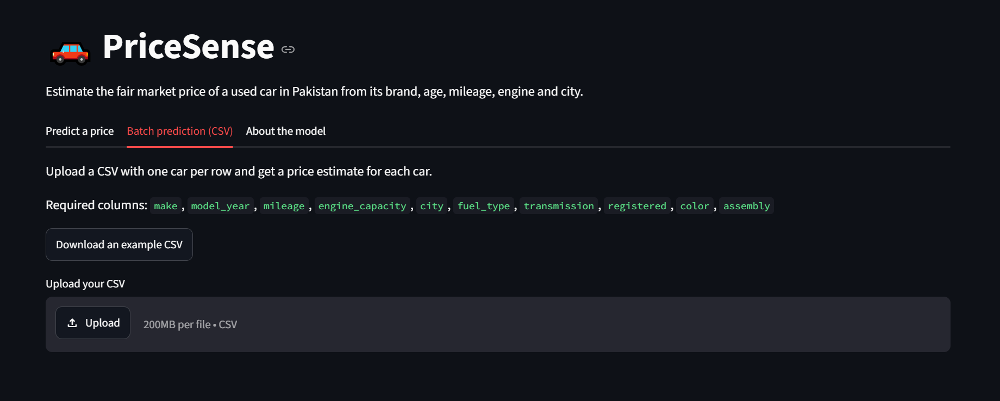

# PriceSense: Used Car Price Predictor

PriceSense estimates the fair market price of a used car in Pakistan from its brand, age, mileage, engine size, city and a few other details.
It is an end-to-end machine learning project: data cleaning, EDA, feature engineering, model comparison, a leak-free scikit-learn Pipeline, and a Streamlit web app.

**Live demo:** (https://pricesense-6hk6b2u76gq2e5fe5m5wac.streamlit.app/)
**Demo video (2-3 min):** (https://youtu.be/7TrxnD-xVc4)

## Results at a glance

| | |
|---|---|
| Final model | Random Forest inside a single scikit-learn Pipeline |
| Test MAE | about 297,000 PKR (2.97 lakh) |
| Test RMSE | about 507,000 PKR |
| Test R2 | 0.935 |
| Baseline (always predict the median price) MAE | about 1,561,000 PKR |
| Typical error per car | about 6% |
| Price range shown in the app | prediction x 0.86 to x 1.16 (contains about 80% of test cars) |

The test set was used once, after the model was chosen with cross-validation.

## Problem

Buyers and sellers on car marketplaces rarely know what a used car is really worth.
The goal is a model that gives a fair price and a likely range, so a listed price can be judged quickly.

## Dataset

- PakWheels used car listings (Kaggle), scraped in 2024
- 48,189 rows and 16 columns: title, price, city, model year, mileage, fuel type, transmission, registration, color, assembly, engine capacity and some derived columns
- Target: `price` in PKR

## Approach

### 1. Data cleaning (48,189 rows to 40,770)

| Step | Rows removed |
|---|---|
| Duplicate rows | 34 |
| Price equal to 0 | 490 |
| Engine capacity outside 600 to 6000 cc | 90 |
| Older than 15 years with under 5,000 km | 913 |
| Price outliers (IQR) | 2,856 |
| Mileage outliers (IQR) | 1,612 |
| Under 100 km but 3 or more years old | 208 |
| Title year does not match `model_year` | 1,207 |
| Cars from 2012 or later priced under 500,000 | 9 |

Two problems were found by inspecting rows, not by summary statistics:

- In 1,207 rows the year at the end of the title disagrees with `model_year` (for example a 1988 Mehran with `model_year` 2024 and 1 km). In those rows `model_year` cannot be trusted, so they were removed.
- "Not Available" in `transmission` is kept as its own category `Unknown`. The data has no "Manual" label, only "Automatic", so calling these cars manual would be a guess.

### 2. Feature engineering

- `make`: first word of the title (with a fix for Mercedes Benz, Land Rover and Range Rover)
- `car_age`: counted from 2024, the year of the data
- `mileage_per_year`
- `brand_tier`: Economy, Mid or Luxury (my own grouping by market position)
- Removed `price_category` (it is built from the target and would leak it), `mileage_category`, `title`, `vehicle_age`, `model_year` and the posting date columns

### 3. EDA

Nine charts with insights are in the notebook. The main findings: price falls steadily with age (about 56 lakh at 1 year, 30 lakh at 10 years, 15 lakh at 20 years), engine size is the second strongest signal, and city has almost no effect.

### 4. Modelling

- The train/test split (80/20) is done before any fitting
- Imputing, scaling and one-hot encoding are inside a `ColumnTransformer` in the Pipeline, so they are learned from the training data only
- Rare categories (under 30 cars) are grouped and unseen categories do not crash the model
- The target is `log(1 + price)`; predictions are converted back to PKR
- Four models were compared with 5-fold cross-validation on the training set:

| Model | CV MAE (PKR) | CV RMSE (PKR) | CV R2 |
|---|---|---|---|
| Baseline (median price) | 1,564,057 | 2,003,508 | -0.029 |
| Ridge | 488,244 | 778,298 | 0.845 |
| Gradient Boosting | 315,209 | 507,480 | 0.934 |
| **Random Forest** | **296,450** | **492,871** | **0.938** |

Test set (used once): **MAE 296,861, RMSE 506,846, R2 0.935**.

The log target made almost no difference to the error (for Random Forest 298,471 with the log and 298,097 without). It stays in the pipeline because it keeps predictions positive and weights percentage errors, not because it improved the score.

### 5. Feature importance

Permutation importance on the test set (increase in MAE when a column is shuffled):

| Feature | MAE increase (lakh PKR) |
|---|---|
| `car_age` | 9.6 |
| `engine_capacity` | 7.6 |
| `transmission` | 2.6 |
| `brand_tier` | 1.8 |
| `make` | 1.3 |
| `city` | 0.05 |

### 6. Price range

The range comes from out-of-fold predictions on the training set: the 10th and 90th percentile of `actual / predicted`.

## The app

- Select the car details and get an estimated price with a likely range
- Optional "Is this a good deal?" check: enter the listed price and compare it with the range
- Feature importance chart
- Batch prediction: upload a CSV and download the predictions
- Unseen categories do not crash the app

Screenshots:

| Prediction | Batch prediction |
|---|---|
|  |  |

## Project structure

```
pricesense/
├── app.py                  Streamlit app
├── requirements.txt        packages for the app
├── requirements-dev.txt    extra packages for the notebook
├── src/
│   ├── config.py           paths and settings
│   ├── cleaning.py         data cleaning steps
│   ├── features.py         feature engineering (shared by training and the app)
│   ├── train.py            trains and saves the model
│   └── predict.py          prediction helpers used by the app
├── notebooks/
│   └── Price_Sense.ipynb   cleaning, EDA and modelling with explanations
├── data/
│   ├── raw/                original PakWheels CSV
│   └── processed/          cleaned_cars.csv
└── models/                 model.joblib, model_metadata.json, feature_importance.csv, model_comparison.csv
```

## How to run

Python 3.12 or 3.13 is recommended. The model was trained with scikit-learn 1.6.1, pandas 2.2.3 and numpy 2.1.3, and loading it with a very different scikit-learn version can fail.

```bash
# 1. create an environment and install the packages
python -m venv venv
venv\Scripts\activate            # Windows (on Mac/Linux: source venv/bin/activate)
pip install -r requirements.txt

# 2. start the app
streamlit run app.py
```

To retrain the model from the raw data (this overwrites the files in `models/`):

```bash
python -m src.train
```

To work on the notebook, install `requirements-dev.txt` instead.

## Limitations

- Prices are 2024 asking prices from listings, not final sale prices, and they are not adjusted for inflation.
- Cars above about 9.4 million PKR were removed as outliers and only about 1% of the data is luxury. Estimates for luxury cars are not reliable.
- Only the brand is used, not the exact model (Corolla, Civic ...), the variant or the condition of the car. Two different models of the same brand, year and engine look the same to the model. Extracting the model name from the title is the next improvement.
- About 40% of the listings have no transmission label and are grouped as `Unknown`.
- The error is larger for expensive cars in rupees (about 5 lakh in the top quarter) and larger for cheap cars in percent (about 10% in the bottom quarter).
- The data comes from one website and one scrape.

## Tech stack

Python, Pandas, NumPy, Matplotlib, Seaborn, scikit-learn, Streamlit